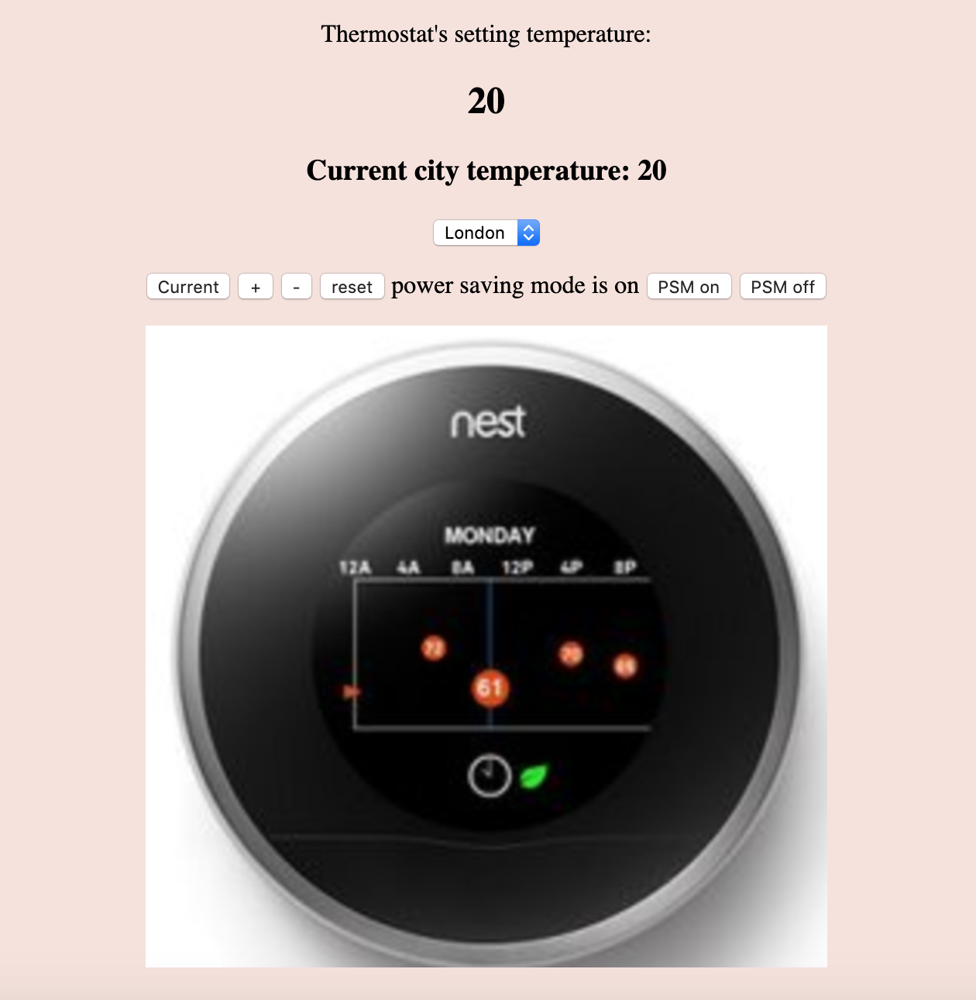

## Thermostat Challenge

This is a single page application (SPA) which is written by JAVASCRIPT.

### How does the application work ?

The application is trying to model a thermostat's behaviour which is working based on the following criteria:

In addition, you can understand the temperature of your city to set the thermostat.

## Thermostat's behaviour

1. The default temperature of the thermostat is 20 degrees.

2.  You can set the temperature of the room by + and - buttons on the application page.

3. The minimum temperature accessible is 10 degrees.

3. You can make the power safe mode on or off by "PSM on" and "PSM off" buttons on the application page.

If the power safe mode is on, the maximum accessible degree in 25 degrees.

If the power safe mode is off, the maximum accessible degree is 32 degrees.

4. You can reset the thermostat and the degree will be 20 degrees by the "reset" button on the application page.

5. You can understand the current temperature of your city by choosing your city's name and the weather temperature is achieved by calling the openweathermap API and it will be shown on the application page.
``` http://api.openweathermap.org/data/2.5/weather? ```


## Running the application

fork or clone the repository. Go to the repository directory in your machine.

run the following command in the command line:

``` open index.html ```

Now, you can use the application as it is shown in the picture below:




## Running the tests

In order to run the tests for the application, you can run the following command in your command line and see the tests' results in your browser.

``` open SpecRunner.html ```


## Technologies used

Javascript (Jquery and AJAX)

Jasmine as test framework

CSS

HTML
